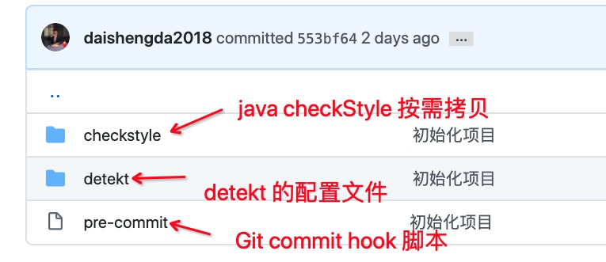
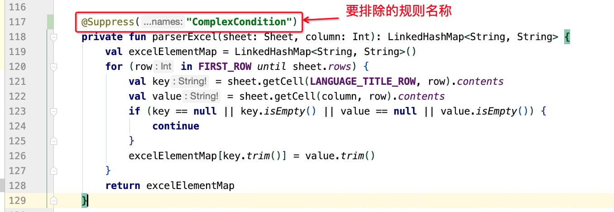

[toc]


# Introduction

[detekt](https://github.com/detekt/detekt) 是一款 kotlin 代码静态检测工具，他对标的是 Java 静态检测工具 checkStyle。detekt 有着检测快、功能强、可配置高等特点，可以帮助开发者尽早的发现代码中的坏气味。


除了 [detekt](https://github.com/detekt/detekt)  还有一种成熟的方案：[ktlint](https://ktlint.github.io/)。 **但 ktlint 的会按照内置规则修改代码**，这是不可容忍的。

虽然 detekt 配置起来复杂一些，但是更加灵活，可以保障团队的代码风格一致，并提前发现不良代码。另外，detekt 的规则是 ktlint 的超集可以通过配置添加

```groovy
detektPlugins "io.gitlab.arturbosch.detekt:detekt-formatting:[version]"
```


# Quick Start

## 添加资源

**在项目更目录创建 config 文件夹[拷贝地址内部的内容](https://github.com/daishengda2018/AndroidCopywritingConverter/tree/master/config)**

> 文件夹内有 checkStyle 的配置，按需拷贝，但 checkStyle 需要特殊配置，本文不描述



注意，**detekt.yml** 的文件路径必须是 config/detekt/detekt.yml 否则配置文件不生效


## 添加 Gradle Plugin

目前 detekt 的最近版本是 1.10.0，[查看detekt 的最新发行版本请参见](https://github.com/detekt/detekt/releases/)


* 如果是 Android 项目在 project build.gradle（位于根目录的）的相应代码块中添加如下内容

```groovy
buildscript { 
     repositories {
       // plugin 地址
        jcenter()
     }

    dependencies {
        // 添加 plugin
        classpath "io.gitlab.arturbosch.detekt:detekt-gradle-plugin:1.10.0"
    }
}


allprojects {
    // 为所有项目应用 detekt，detekt 将自动识别 kt 代码做检查
    apply plugin: 'io.gitlab.arturbosch.detekt'
}

```

* 如果是 Gradle 构建的其他项目在 project build.gradle 相应代码块中添加如下内容

```java
plugins {
    id 'io.gitlab.arturbosch.detekt' version '1.1.0'
}
```


上述步骤完毕后添加 detekt 设置文件

```groovy
apply from: "./config/detekt.gradle”
```


## 添加 ktlint 拓展规则集 (可选)

目前 detekt 的最近版本是 1.10.0，[查看detekt 的最新发行版本请参见](https://github.com/detekt/detekt/releases/)

* 如果是 Android 项目，在需要开启检测的模块中添加如下配置：

```
dependencies {
		......
    detektPlugins "io.gitlab.arturbosch.detekt:detekt-formatting:[version]"
}
```

* 如果是 Gradle 构建的其他项目，继续在 project build.gradle 相应代码块中添加：

```
dependencies {
......
    detektPlugins "io.gitlab.arturbosch.detekt:detekt-formatting:[version]"
}
```


## 添加 git hook

在 commit 代码时检测规则与质量是最好的时机

具体文件地址： config/detekt/pre.commit

```shell
#!/usr/bin/env bash
#
# 方案一： https://arturbosch.github.io/detekt/git-pre-commit-hook.html
# 将该文件放到project根目录的.git/hooks/目录下，执行 chmod +x pre-commit 为脚本添加可执行权限即可，
# 之后的每次commit都会先执行 checkstyle task 进行代码检查
#
# 方案二： https://stackoverflow.com/questions/427207/can-git-hook-scripts-be-managed-along-with-the-repository
# 从git 2.9开始, 可以设置:core.hooksPath了.
# 可以在repo里面添加一个目录hooks, 然后把git hooks文件放进去track.
# 在命令行跑:
# git config core.hooksPath [文件路径]
# 把找hook文件的目录设置成指定目录就好了.

echo "执行 kotlin 代码规范检查..."
./gradlew detekt
EXIT_CODE=$?
if [ $EXIT_CODE -ne 0 ]; then
  echo "***********************************************"
  echo "                 Detekt failed                 "
  echo " Please fix the above issues before committing "
  echo "***********************************************"
  exit $EXIT_CODE
fi

#echo "执行 checkstyle 任务 "
#./gradlew checkstyle
```


## 执行

提交代码时将会触发 hook ，开始检测代码，如果有不良代码提交将被中断，按提示修正代码方可提交


错误提示


# 排除

方式1：

对于上图的 ComplexCondition 错误，如果想要排除掉可以使用@Suppress 注解 [详情请参见说明](https://detekt.github.io/detekt/suppressing-rules.html)





方式2：[配置 baseLine](https://detekt.github.io/detekt/baseline.html)


# 配置文件说明

## detekt.yml

detekt.yml 是检测的规则集合，可以通过修改此配置文件直接指定是否启用规则、规则参数等信息。

位于 config/detekt/detekt.yml 的配置文件已经设置了常用规则，直接使用就可以。每个规则的具体说明请参见：[规则说明](https://detekt.github.io/detekt/comments.html)


## detekt.gradle

detekt 的 gradle 设置

```groovy
detekt {
    failFast = true     // fail build on any finding
    config = files("config/detekt/detekt.yml") // 规则配置文件，必须是此路径，否者不生效
    buildUponDefaultConfig = true

    //输出形式
    reports {
        html.enabled = true // observe findings in your browser with structure and code snippets
        xml.enabled = false // checkstyle like format mainly for integrations like Jenkins
        txt.enabled = true  // similar to the console output, contains issue signature to manually edit baseline files
    }
}

// Groovy dsl
tasks.detekt.jvmTarget = "1.8"
```

如果开启了 html 输出结果在模块的 build 文件夹下


# 参考资源

[GitHub 项目地址](https://github.com/detekt/detekt) 

[项目主页](https://detekt.github.io/detekt/index.html)

[规则说明](https://detekt.github.io/detekt/comments.html)


# 拓展阅读: Android Lint

[Android静态代码扫描效率优化与实践](https://tech.meituan.com/2019/11/07/android-static-code-canning.html)

[美团外卖Android Lint代码检查实践](https://juejin.im/post/5acf61aa518825556a72ce32)

